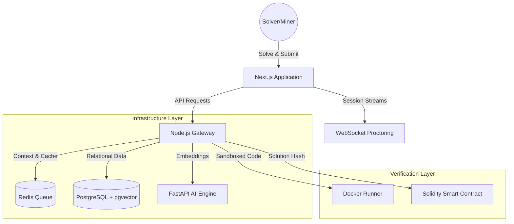

# MindLedger — The Proof-of-Intellect (PoI) Protocol

[](https://nextjs.org/)
[](https://nodejs.org/)
[](https://fastapi.tiangolo.com/)
[](https://www.postgresql.org/)
[](https://redis.io/)
[](https://soliditylang.org/)

MindLedger is a decentralized academic "mining" platform. Students earn **$POI tokens** by solving Olympiad-level problems (JEE, INMO, IPhO). The platform uses **AI-driven anti-cheat**, **semantic fingerprinting** via `pgvector`, and a **P2P verification network**.

---

## 🏛️ System Architecture



---

## 🚀 Installation & Setup

### Method A: The Rapid Deployment (Recommended)
Use Docker Compose to spin up the entire stack (Database, Redis, AI-Engine, Backend, and Frontend) with a single command.

**Prerequisites:** [Docker Desktop](https://www.docker.com/products/docker-desktop/) installed and running.

1.  **Clone the Repository:**
    ```bash
    git clone https://github.com/anmol392/MindLedger.git
    cd MindLedger
    ```

2.  **Start the Services:**
    ```bash
    docker-compose up --build -d
    ```

3.  **Access the Platform:**
    -   Frontend: `http://localhost:3000`
    -   API Server: `http://localhost:8000`
    -   AI Engine: `http://localhost:8001`

---

### Method B: Manual Component-wise Setup
Use this for granular development if you don't have Docker.

#### 1. Database & Cache
You need a running **PostgreSQL** (version 15+ with `pgvector` extension) and **Redis** instance.

#### 2. Backend API Server (Node.js)
```bash
cd backend/api_server
npm install
# Sync database schema (requires PG to be active)
npx prisma db push
# Seed initial problems
node prisma/seed.js
# Start server
node index.js
```

#### 3. AI-Engine (Python)
```bash
cd backend/ai_engine
python -m venv venv
source venv/bin/activate  # Windows: .\venv\Scripts\activate
pip install -r requirements.txt
python main.py
```

#### 4. Frontend (Next.js)
```bash
cd frontend
npm install
npm run dev
```

---

## 🏗️ Repository Structure

| Directory | Purpose | Tech Stack |
| :--- | :--- | :--- |
| `frontend/` | Core user interface & dashboards | Next.js 15, Tailwind 4, Framer Motion |
| `backend/api_server/` | Request gateway, proctoring & logic | Node.js, Express, Socket.io, Prisma |
| `backend/ai_engine/` | Plagiarism & AI-trap detection | FastAPI, Sentence-Transformers, PyTorch |
| `blockchain/` | Smart contracts & tokenomics | Solidity (ERC-20 + custom PoI logic) |

---

## 🛡️ Security & Anti-Cheat Protocols

1.  **Semantic Fingerprinting**: Every solution is vectorized using `all-MiniLM-L6-v2`. Any solution with >0.91 cosine similarity to existing solutions is flagged for plagiarism.
2.  **AI-Trap Injection**: Problems contain subtle "hallucination traps" (physically impossible constraints) that LLMs often miss but humans catch.
3.  **Live Proctoring**: WebRTC background streams verify the presence and focus of the solver in real-time.

---

## 📄 License & attribution
This project is open-source under the **MIT License**. 

Built with precision for the global elite.
© 2026 MindLedger Protocol.
