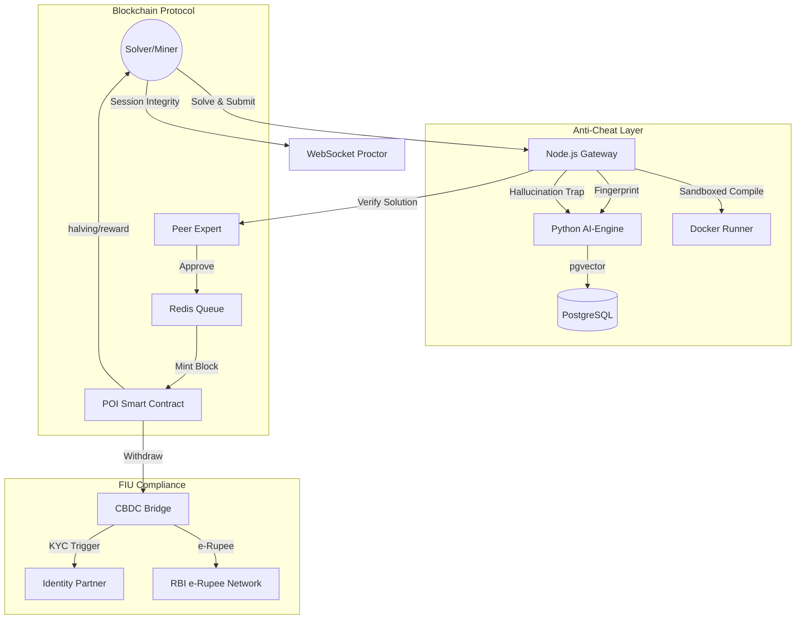

# MindLedger — Backend Architecture & Platform Security

MindLedger is a Proof-of-Intellect (PoI) platform built with Node.js, Python FastAPI, PostgreSQL (pgvector), and Solidity.

---

## 🏛️ System Architecture

---

## 🚀 API Documentation (Core v1)

### 1. Problem Management
- **GET /api/problems**: List active claimable problems.
- **GET /api/problems/:id**: Detailed problem statement (Markdown/LaTeX).
- **POST /api/problems**: Submit new problem pool (Professor role only).

### 2. Solving & Submission
- **POST /api/solve/claim**: Claim unique variant of a problem (Starts session).
- **POST /api/solve/test**: Local dry-run in Docker sandbox.
- **POST /api/solve/submit**: Formal submission with anti-cheat analysis.

### 3. Proof-of-Intellect Block Generation
- **GET /api/blocks**: Browse on-chain block history.
- **GET /api/wallet/balance**: Real-time POI balance.
- **POST /api/withdraw**: Convert POI to e-Rupee via CBDC bridge.

---

## 🛡️ Anti-Cheat & Security Modules

### Layer 1: Session Integrity
- **Real-time Proctoring**: WebSocket stream validates student presence.
- **Biometric Locking**: Face verification ensures consistent solver identity.

### Layer 2: Machine Hallucination Trap
- **Novel Security**: Deliberately wrong physical constants or mathematical premises are injected into statements.
- **Human vs AI**: Humans catch the error; AI accepts the premise, flagging the submission as non-originating from a human mind.

### Layer 3: Semantic Fingerprinting
- **Fingerprinting**: 384-dimension vectors stored in `pgvector` index.
- **Plagiarism Detection**: Rejection for cosine similarity > 0.91 with historic solutions.

---

## ⚒️ Local Setup
1. **Blockchain**: Deployed Hardhat node for Solidity testing.
2. **Infrastructure**: `docker-compose up -d` to spin up Postgres, Redis, and AI-Engine.
3. **Environment**: Configure `.env` with `DB_URL` and `REDIS_URL`.

Built with ⚡ for the global academic elite.
MindLedger Protocol (c) 2026.
